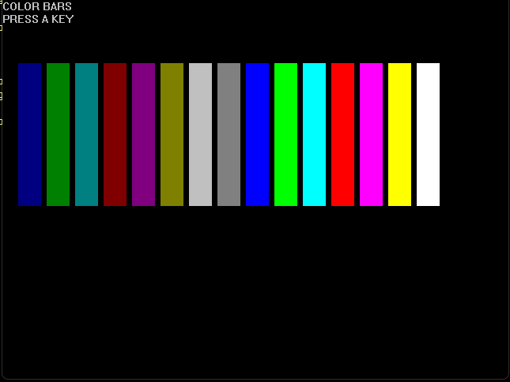
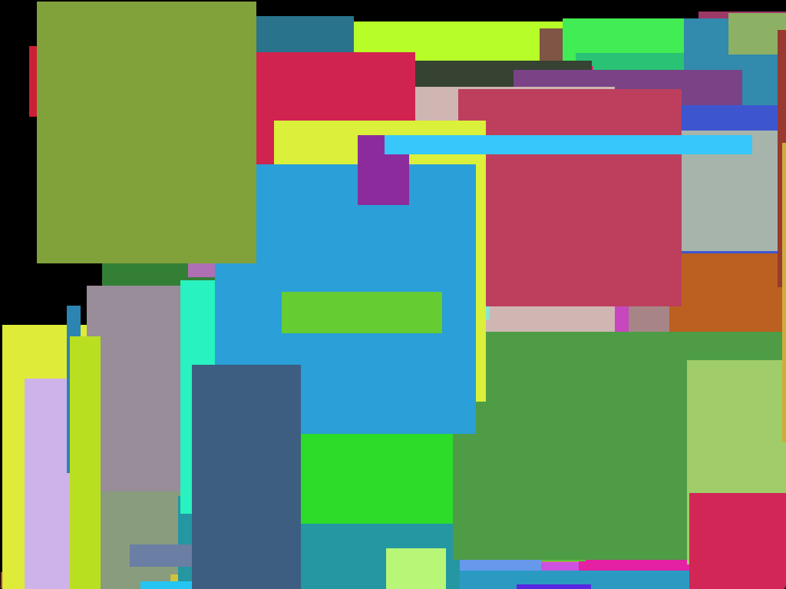
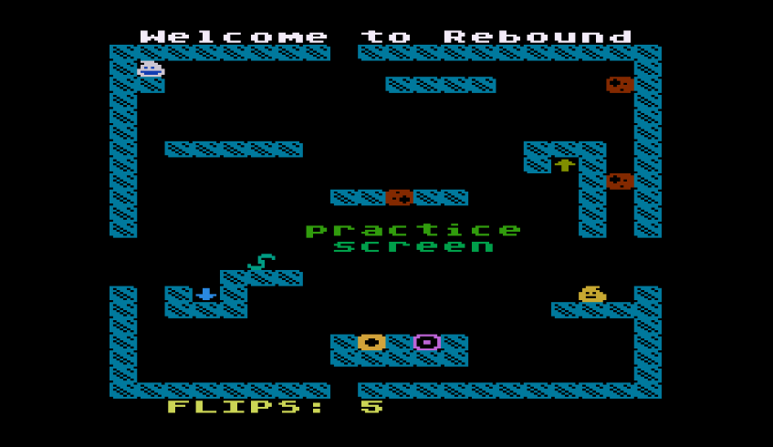

# Screenshots

This directory shows screenshots and emulator captures of CrustyBASIC example
programs running on supported targets.  The images without -cb in their name
are compiled from the same source listing.  Images with -dialect are original, 80s
era listings compiled with crustyBASIC.

<!-- SCREENSHOTS_START -->
<table>
  <tr>
    <td align="center" valign="top">
       
      <b>balls-c64.png</b>
    </td>
    <td align="center" valign="top">
       
      <b>breakout-cb-a2600.png</b>
    </td>
    <td align="center" valign="top">
       
      <b>char_dungeon-a800.png</b>
    </td>
    <td align="center" valign="top">
       
      <b>char_dungeon-c64.png</b>
    </td>
  </tr>
  <tr>
    <td align="center" valign="top">
       
      <b>char_dungeon-coco.png</b>
    </td>
    <td align="center" valign="top">
       
      <b>char_dungeon-dos16.png</b>
    </td>
    <td align="center" valign="top">
       
      <b>char_dungeon-nes.png</b>
    </td>
    <td align="center" valign="top">
       
      <b>char_dungeon-plus4.png</b>
    </td>
  </tr>
  <tr>
    <td align="center" valign="top">
       
      <b>char_dungeon-vic20.png</b>
    </td>
    <td align="center" valign="top">
       
      <b>color_bars-winx64.png</b>
    </td>
    <td align="center" valign="top">
       
      <b>color_grid-a800.png</b>
    </td>
    <td align="center" valign="top">
       
      <b>color_grid-c64.png</b>
    </td>
  </tr>
  <tr>
    <td align="center" valign="top">
       
      <b>color_grid-coco.png</b>
    </td>
    <td align="center" valign="top">
       
      <b>color_grid-dos16.png</b>
    </td>
    <td align="center" valign="top">
       
      <b>color_grid-plus_4.png</b>
    </td>
    <td align="center" valign="top">
       
      <b>colors-cb-vic20.png</b>
    </td>
  </tr>
  <tr>
    <td align="center" valign="top">
       
      <b>extended_background-plus_4.png</b>
    </td>
    <td align="center" valign="top">
       
      <b>gdi_rectangles-winx64.png</b>
    </td>
    <td align="center" valign="top">
       
      <b>graphics-a800.png</b>
    </td>
    <td align="center" valign="top">
       
      <b>graphics-c64.png</b>
    </td>
  </tr>
  <tr>
    <td align="center" valign="top">
       
      <b>graphics-dos16.png</b>
    </td>
    <td align="center" valign="top">
       
      <b>graphics-plus4.png</b>
    </td>
    <td align="center" valign="top">
       
      <b>graphics-plus_4.png</b>
    </td>
    <td align="center" valign="top">
       
      <b>invaders-a800.png</b>
    </td>
  </tr>
  <tr>
    <td align="center" valign="top">
       
      <b>invaders-c64.png</b>
    </td>
    <td align="center" valign="top">
       
      <b>invaders_s-a800.png</b>
    </td>
    <td align="center" valign="top">
       
      <b>invaders_s-c64.png</b>
    </td>
    <td align="center" valign="top">
       
      <b>koala-c64.png</b>
    </td>
  </tr>
  <tr>
    <td align="center" valign="top">
       
      <b>lemonade_stand-applesoft-dialect.png</b>
    </td>
    <td align="center" valign="top">
       
      <b>luma_wave-plus_4.png</b>
    </td>
    <td align="center" valign="top">
       
      <b>meteor_dodge-a800.png</b>
    </td>
    <td align="center" valign="top">
       
      <b>meteor_dodge-c64.png</b>
    </td>
  </tr>
  <tr>
    <td align="center" valign="top">
       
      <b>meteor_dodge-coco.png</b>
    </td>
    <td align="center" valign="top">
       
      <b>meteor_dodge-dos16.png</b>
    </td>
    <td align="center" valign="top">
       
      <b>meteor_dodge-plus4.png</b>
    </td>
    <td align="center" valign="top">
       
      <b>meteor_dodge-plus_4.png</b>
    </td>
  </tr>
  <tr>
    <td align="center" valign="top">
       
      <b>rebound-atari_basic-dialect.png</b>
    </td>
    <td align="center" valign="top">
       
      <b>snake-cell-c64.png</b>
    </td>
    <td align="center" valign="top">
       
      <b>snake-nes.png</b>
    </td>
    <td align="center" valign="top">
       
      <b>snake-vic20.png</b>
    </td>
  </tr>
  <tr>
    <td align="center" valign="top">
       
      <b>sprite-cb-nes.png</b>
    </td>
    <td align="center" valign="top">
       
      <b>sprite_storm-nes.png</b>
    </td>
    <td align="center" valign="top">
       
      <b>taipan-applesoft-dialect.png</b>
    </td>
    <td align="center" valign="top">
       
      <b>ted_palette-cb-plus4.png</b>
    </td>
  </tr>
  <tr>
    <td align="center" valign="top">
       
      <b>tile_neon-cb-dos16.png</b>
    </td>
    <td align="center" valign="top">
       
      <b>vga_burst-cb-dos16.png</b>
    </td>
    <td></td>
    <td></td>
  </tr>
</table>
<!-- SCREENSHOTS_END -->
